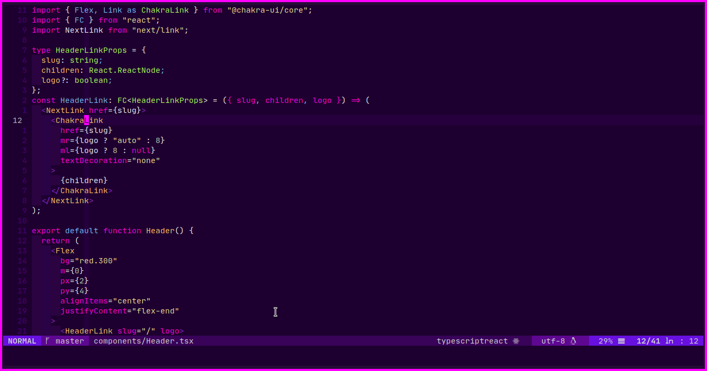
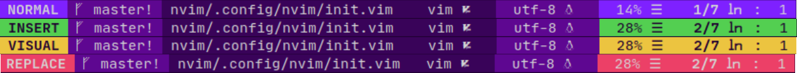

# Purpura colorscheme for [vim](https://github.com/vim/vim)

> A [purple](https://github.com/yassinebridi/vim-purpura) theme for [vim](https://github.com/vim/vim)



#### Airline

---

A similar theme for tmux is here: [tmux-purpura](https://github.com/yassinebridi/tmux-purpura)

---
Please read [WIP](#wip)

## Install
### 1) Download
*  [vim-plug](https://github.com/junegunn/vim-plug)
```
Plug 'yassinebridi/vim-purpura'
```
then install the plugin:
```
:PlugInstall
```
*  [Vundle](https://github.com/gmarik/vundle)
```
Plugin 'yassinebridi/vim-purpura'
```
then install the plugin:
```
:PluginInstall
```
### 2) Enable in `.vimrc`/`init.vim`
Add the following line to your `.vimrc` or `init.vim`:

```vim
colorscheme purpura
```
Make sure to have these lines too in your vimrc, if you don't already:
```vim
set background=dark
set termguicolors
let &t_8f = "\<Esc>[38;2;%lu;%lu;%lum"
let &t_8b = "\<Esc>[48;2;%lu;%lu;%lum"
```
If you have [`vim-airline`](https://github.com/vim-airline/vim-airline), you can also enable the provided theme:

```
let g:airline_theme = 'purpura'
```

If you prefere [`vim-crystalline`](https://github.com/rbong/vim-crystalline), you can just change your settings to be like so:

```vim
let g:crystalline_theme = 'purpura'
```
for [`vim-lightline`](https://github.com/itchyny/lightline.vim)
read [`WIP`](#wip)

then exit vim, and reopen or simply source your `.vimrc`/`init.vim`.
```bash
:so %
```
## For React/JSX/TSX developers
it's advised to install this plugin:
```
Plug 'maxmellon/vim-jsx-pretty'
```
## WIP
- This is optimized for react/typescript developments, it partialy works for other languages, but not as good.
- Better support cterm colors.
- Support lightline.
